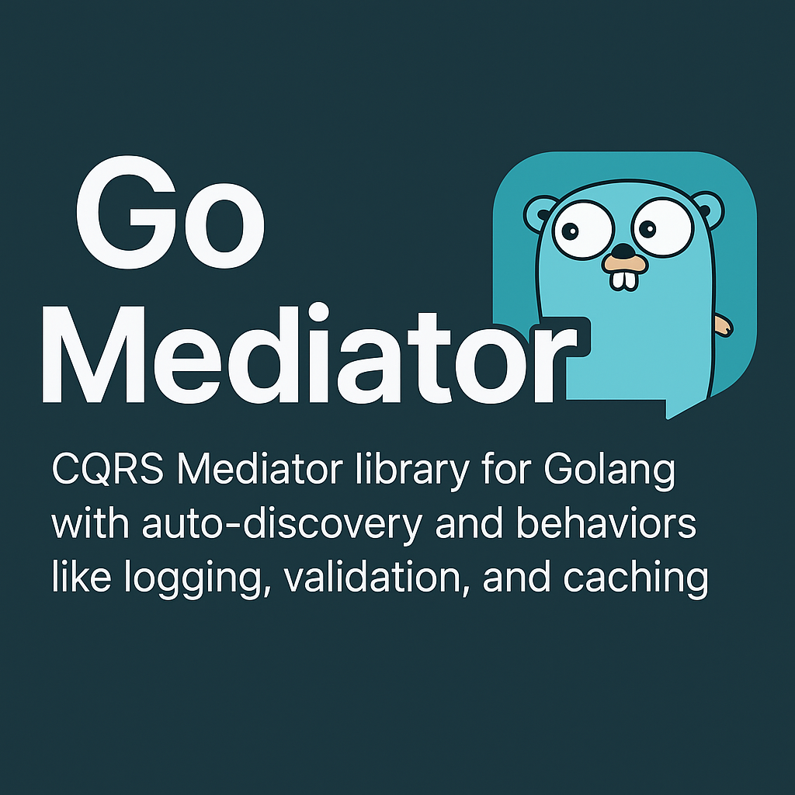

# Golang Mediator

A lightweight and extensible **CQRS Mediator library for Golang** with support for:
- ✅ Auto-discovery of handlers based on naming convention
- ✅ Behaviors (like Logging, Caching, Validation)
- ✅ Command/Query separation
- ✅ Plug-and-play handler registration

---

## 📦 Installation

```bash
go get github.com/wordcoolframework/golang-mediator@latest
```

## 🚀 Quick Start

### 1. Define a Query


```go
// app/Queries/GetUserQuery.go
package Queries

type GetUserQuery struct {
    UserID uint
}
```

### 2. Create the Handler

```go
// app/QueryHandlers/GetUserQueryHandler.go
package QueryHandlers

type GetUserQueryHandler struct{}

func (h *GetUserQueryHandler) Handle(query contracts.Query) (interface{}, error) {
    q := query.(Queries.GetUserQuery)
    return map[string]interface{}{
        "id":   q.UserID,
        "name": "Arash 1380",
    }, nil
}
```

### 3. Use Mediator in Main

```go
m := mediator.New()

m.Register(QueryHandlers.GetUserQueryHandler{})

app.Get("/user/:id", func(c *fiber.Ctx) error {

    id, _ := strconv.Atoi(c.Params("id"))
    query := Queries.GetUserQuery{ID: id}
    
    res, err := m.Send(query)
    
    if err != nil {
        return c.Status(500).SendString(err.Error())
    }
    
    return c.JSON(res)
})
```

### 4. Behaviors (Middleware-like Plugins)

```go
m.UseBehavior(behaviors.LogBehavior)
m.UseBehavior(behaviors.TimerBehavior)
```


### 5. Builder (Use Builder Method Like Chainable)

```go
m := builders.NewBuilder().
    UseBehavior(behaviors.LogBehavior).
    Register(&QueryHandlers.GetUserQueryHandler{}).
    Build()

app.Get("/user/:id", func(c *fiber.Ctx) error {
    
    id, _ := strconv.Atoi(c.Params("id"))
    query := Queries.GetUserQuery{ID: uint(id)}
    
    res, err := m.Send(query)
    
    if err != nil {
        return c.Status(500).SendString(err.Error())
    }
    
        return c.JSON(res)
    })

app.Listen(":3000")
```

### 6. DI (Inject Services)
```go

package Services

type UserService struct{}

func (u *UserService) GetUser(username string) string {
    return "Hello " + username
}


package QueryHandlers

type GetUserQueryHandler struct {
    userService Services.UserService
}

func (h *GetUserQueryHandler) Handle(q Queries2.GetUserQuery) (map[string]string, error) {
    return map[string]string{
    "id":                fmt.Sprintf("%d", q.ID),
    "name":              "Arash Narimani",
    "user-service-data": h.userService.GetUser("arash"),
    }, nil
}


package main

// use Provide(&Services.UserService{}).
m := builders.NewBuilder().
    UseBehavior(behaviors.LogBehavior).
    Register(&QueryHandlers.GetUserQueryHandler{}).
    Provide(&Services.UserService{}).
    Build()
```

✅ Features
* CQRS Pattern

* No switch/case logic

* Simple and testable

* Chainable Behaviors like Middleware

* Auto-discovery by name

